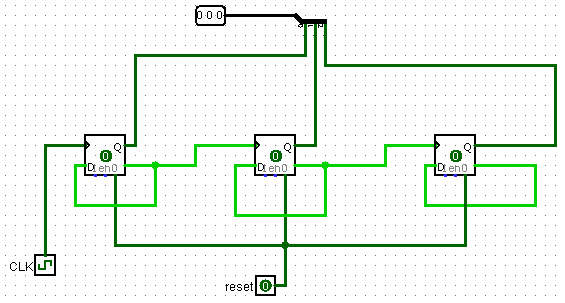
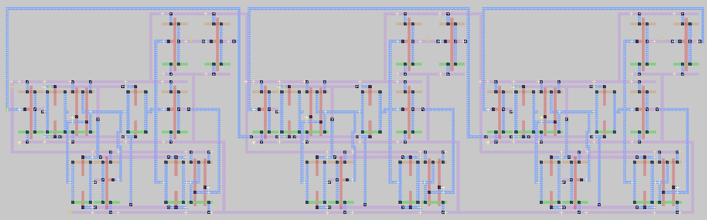

# 3-Bit Counter 
problem statment:
- Designing a 3-bit counter in a simulation environment(Logisim)
- Implement the design in a layout tool (Magic tool)

#### First we designed a 3-bit counter using 3 D flip-flops in Logisim and tested it for all values:

#### Implementation in Magic tool:

