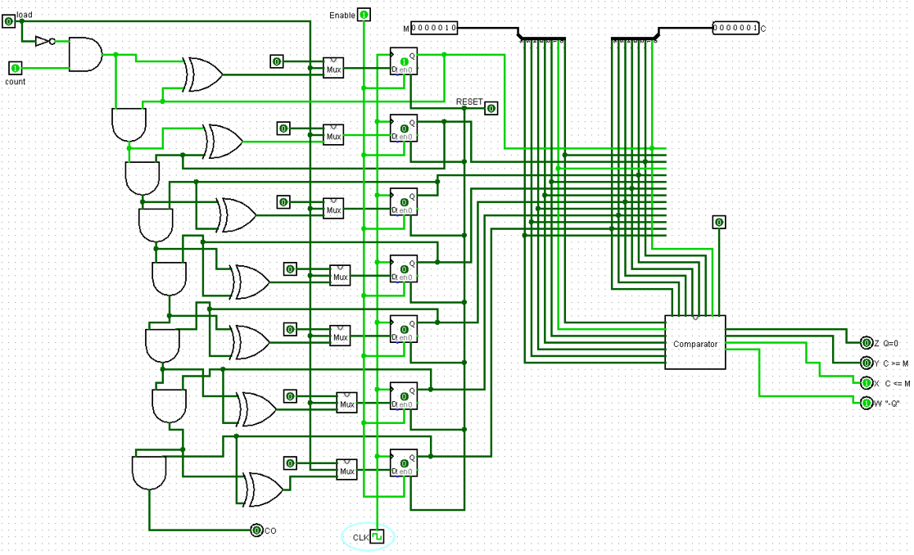

# Problem statement
Implementing a circuit that has a 7-bit counter, C,
with clear and reset options that continuously compare it with a 7-bit unsigned number M.
The comparison results in 4 outputs based on Q = C-M

| Comparison output  | output |
| ------------- | ------------- |
| W  | W=1 if Q negative  |
| X  | X=1 if C <= M  |
| Y  | Y=1 if C >= M  |
| Z  | Z=1 if Q = 0  |

## design main components:
- Full adder:\

- 7-Bit adder using the full adder:\

- Comparator:\

- 2x1 Multiplexer\

## Full design:

